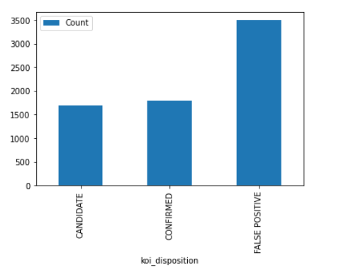

# machine-learning-challenge

Machine Learning Homework - Exoplanet Exploration
Over a period of nine years in deep space, the NASA Kepler space telescope has been out on a planet-hunting mission to discover hidden planets outside of our solar system.

This data to create machine learning models capable of classifying candidate exoplanets from the raw dataset.

Here in this project, I have two different models: Logistic Regression and 2nd Random Forest Classifier, to classify the exoplanets. Below is the summary of the process to build these models and a detailed report about the two models' findings and performance comparison.

